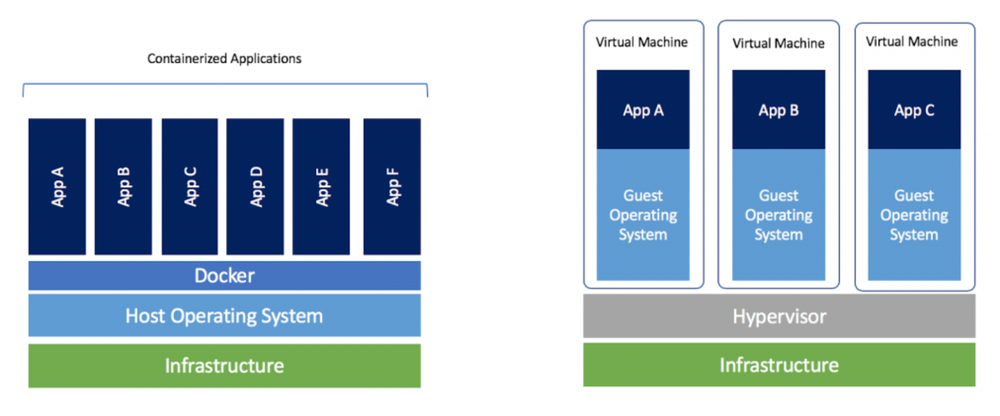

## Introducción a Docker
- ¿Qué es Docker?

Docker es una plataforma de código abierto que permite automatizar el despliegue de aplicaciones dentro de contenedores de software. Los contenedores son una forma de empaquetar una aplicación con todas sus dependencias y ejecutarla de forma aislada en cualquier entorno.

- Historia y contexto

Docker fue lanzado por primera vez en 2013 y se basa en tecnologías de contenedores Linux existentes, como cgroups y namespaces, para crear un entorno ligero y portátil para aplicaciones. Docker se ha convertido en una herramienta popular en el desarrollo de software moderno debido a su capacidad para simplificar el proceso de desarrollo, pruebas y despliegue de aplicaciones.

- Ventajas y casos de uso

  - Aislamiento de aplicaciones: Los contenedores proporcionan un entorno aislado para ejecutar aplicaciones, lo que ayuda a prevenir conflictos entre ellas.
  - Portabilidad: Los contenedores Docker pueden ejecutarse en cualquier entorno que admita Docker, lo que facilita el despliegue de aplicaciones en diferentes plataformas.
  - Escalabilidad: Docker permite escalar aplicaciones de forma rápida y sencilla mediante la creación de múltiples instancias de contenedores.
  - Eficiencia: Los contenedores Docker son ligeros y comparten el kernel del sistema operativo, lo que los hace más eficientes en recursos que las máquinas virtuales.

- Algunos casos de uso comunes de Docker incluyen:
  - Despliegue de aplicaciones: Docker facilita el despliegue de aplicaciones al proporcionar un entorno consistente y predecible para su ejecución.
  - Desarrollo de software: Los contenedores Docker permiten a los desarrolladores trabajar en entornos aislados que reproducen fielmente el entorno de producción.
  - Microservicios: Docker es una herramienta popular para implementar arquitecturas de microservicios, ya que permite a las aplicaciones estar encapsuladas en contenedores independientes y escalables.

## Conceptos fundamentales
- Contenedores vs. máquinas virtuales
  
    - **Máquinas virtuales (VMs):**
    - Las VMs emulan un hardware físico para ejecutar sistemas operativos y aplicaciones.
    - Cada VM incluye un sistema operativo completo, lo que puede llevar a un uso intensivo de recursos.
    - El tiempo de inicio de una VM puede ser relativamente largo.

    - **Contenedores:**
    - Los contenedores comparten el mismo sistema operativo y kernel del host, lo que los hace más ligeros.
    - Cada contenedor ejecuta una aplicación o proceso específico, con sus propias bibliotecas y dependencias, pero comparte el kernel con otros contenedores.
    - Los contenedores son más rápidos de iniciar que las VMs y utilizan menos recursos.
      
  
      
- Imágenes Docker

  - Las imágenes Docker son plantillas de solo lectura que contienen el sistema operativo, las bibliotecas y las dependencias necesarias para ejecutar una aplicación.
  - Las imágenes se utilizan para crear contenedores Docker, que son instancias en ejecución de una imagen.
  - Las imágenes se definen mediante un archivo Dockerfile, que especifica los pasos necesarios para construir la imagen.
    
- Contenedores Docker

  - Un contenedor Docker es una instancia en ejecución de una imagen Docker.
  - Los contenedores proporcionan un entorno aislado para ejecutar aplicaciones, con sus propios procesos, redes y sistemas de archivos.
  - Los contenedores son portátiles y pueden ejecutarse en cualquier entorno que admita Docker.
    
- Docker Engine

  - Docker Engine es el componente de Docker que ejecuta y gestiona los contenedores Docker.
  - Docker Engine incluye el daemon de Docker, que es un servicio que se ejecuta en segundo plano para gestionar la creación, ejecución y destrucción de contenedores.
  - Docker Engine también incluye la CLI de Docker, que se utiliza para interactuar con el daemon y gestionar los contenedores y las imágenes.


## Instalación y configuración
- Descarga e instalación en diferentes sistemas operativos
- Configuración básica

## Crear imagen docker

###Una vez construida la imagen, se puede utilizar para crear y ejecutar contenedores Docker
  
  docker build -t mydjangoapp .

Esto construiría una imagen con nombre "mi_imagen" a partir del Dockerfile en el directorio actual

## Creación y gestión de contenedores

- Ejecución de contenedores
  - Para ejecutar un contenedor Docker, se utiliza el comando `docker run`.

  docker run -p 5000:443 mydjangoapp

- Interacción con contenedores
  
  - Para interactuar con un contenedor en ejecución, se pueden utilizar varios comandos de Docker, como `docker exec`, `docker attach`, y `docker logs`.
  - Ejemplo: `docker exec -it mydjangoapp /bin/bash` (esto abriría una sesión bash interactiva en el contenedor llamado "mi_contenedor").

- Ciclo de vida de un contenedor
  
  1. **Creación:** Un contenedor se crea a partir de una imagen Docker utilizando el comando `docker run`.
  2. **Ejecución:** El contenedor está en ejecución mientras su proceso principal (PID 1) está en ejecución.
  3. **Pausa:** Se puede pausar un contenedor en ejecución utilizando el comando `docker pause`.
  4. **Reanudación:** Un contenedor pausado se puede reanudar utilizando el comando `docker unpause`.
  5. **Detención:** Un contenedor en ejecución se puede detener utilizando el comando `docker stop`.
  6. **Inicio:** Un contenedor detenido se puede reiniciar utilizando el comando `docker start`.
  7. **Eliminación:** Un contenedor detenido se puede eliminar utilizando el comando `docker rm`.


## Dockerfile
- Estructura y sintaxis
  
  - Un Dockerfile es un archivo de texto plano que contiene una serie de instrucciones que Docker utiliza para construir una imagen Docker.
  - Cada instrucción en un Dockerfile se ejecuta secuencialmente y se utiliza para definir diferentes aspectos de la imagen, como el sistema operativo base, las dependencias, los comandos a ejecutar, etc.
  - El Dockerfile debe comenzar con una instrucción `FROM` que especifique la imagen base a partir de la cual se construirá la nueva imagen.

- Instrucciones básica
  
  - **FROM:** Especifica la imagen base a partir de la cual se construirá la nueva imagen.
  - **RUN:** Ejecuta comandos en la nueva capa de la imagen y crea una nueva capa con los resultados. Se utiliza para instalar paquetes, configurar el entorno, etc.
  - **COPY:** Copia archivos y directorios desde el sistema de archivos del host al sistema de archivos de la imagen.
  - **ADD:** Similar a COPY, pero también puede aceptar URLs como fuente y descomprimir automáticamente archivos comprimidos.
  - **CMD:** Proporciona un comando predeterminado para ejecutar cuando se inicie un contenedor a partir de la imagen. Solo puede haber una instrucción CMD en un Dockerfile.
  - **ENTRYPOINT:** Define un comando que se ejecutará cada vez que se inicie un contenedor a partir de la imagen. Puede haber solo una instrucción ENTRYPOINT en un Dockerfile.
  - **ENV:** Establece variables de entorno dentro de la imagen.
  - **EXPOSE:** Expone puertos en los contenedores basados en la imagen.
  - **WORKDIR:** Establece el directorio de trabajo para cualquier instrucción RUN, CMD, ENTRYPOINT, COPY y ADD que se ejecute en la imagen.
  - **VOLUME:** Crea un punto de montaje para almacenar datos generados por el contenedor o para acceder a datos desde el host.


## Redes en Docker
- Tipos de redes en Docker

1. **Bridge Network (Red de puente)**:
   - Es la red por defecto en Docker.
   - Permite la comunicación entre contenedores en el mismo host mediante una red virtual.
   - Cada contenedor conectado a esta red obtiene una dirección IP única dentro de la subred de puente.
   - Puedes crear tu propia red de puente personalizada para aislar tus contenedores.

2. **Host Network (Red de anfitrión)**:
   - Con esta opción, el contenedor no tiene su propia interfaz de red, sino que usa directamente la interfaz de red del host.
   - Esto permite que el contenedor tenga acceso directo a todos los servicios disponibles en el host, sin necesidad de redireccionamiento de puertos.

3. **Overlay Network (Red superpuesta)**:
   - Es útil para conectar contenedores que se ejecutan en diferentes hosts Docker.
   - Permite la comunicación segura y transparente entre contenedores en diferentes hosts utilizando un enrutamiento basado en VXLAN (Virtual Extensible LAN).
   - Es especialmente útil en entornos distribuidos y en la orquestación de contenedores con herramientas como Docker Swarm o Kubernetes.

4. **Macvlan Network (Red Macvlan)**:
   - Proporciona a los contenedores direcciones IP directamente desde la red física del host.
   - Cada contenedor se ve como un dispositivo de red independiente en la red física, con su propia dirección MAC y dirección IP.
   - Esto permite que los contenedores se integren perfectamente en redes existentes, como si fueran máquinas virtuales o servidores físicos.

5. **None Network (Sin red)**:
   - Con esta opción, se deshabilita la configuración de red para el contenedor.
   - El contenedor no tendrá acceso a ninguna red, ni siquiera a la red local del host.
   - Se utiliza en situaciones donde no se requiere conectividad de red para el contenedor.

Cada tipo de red en Docker tiene sus propias ventajas y casos de uso específicos, por lo que es importante comprender cómo funcionan y cuándo utilizar cada uno.

- Creación y gestión de redes

1. Crear una red de puente (bridge):


```sh
  docker network create <nombre_red>
```

2. Crear una red de anfitrión (host):

No es necesario crearla, ya que utiliza directamente la red del host.

3. Crear una red superpuesta (overlay):


```sh
  docker network create --driver overlay <nombre_red>
```

3. Crear una red Macvlan:

Para crear una red Macvlan, es necesario especificar la configuración de red adecuada, como la subred y la puerta de enlace. Este es un ejemplo básico:

```sh
  docker network create -d macvlan --subnet=192.168.1.0/24 --gateway=192.168.1.1 -o parent=eth0 <nombre_red>
```

Reemplaza eth0 con el nombre de tu interfaz de red.

- Gestión de redes

Listar redes:

```sh
docker network ls
```

Inspeccionar una red:

```sh
docker network inspect <nombre_red>
```

Esto mostrará información detallada sobre la red, incluidos los contenedores conectados a ella.
Conectar un contenedor a una red:

```sh
  docker network connect <nombre_red> <nombre_contenedor>
```

Desconectar un contenedor de una red:

```sh
docker network disconnect <nombre_red> <nombre_contenedor>
```

Eliminar una red:

```sh
docker network rm <nombre_red>
```

Antes de eliminar una red, asegúrate de que no haya contenedores conectados a ella.

- Conexión de contenedores en redes

1. Crear una red de puente (si no está creada):

```sh
docker network create mi_red_bridge
```

Iniciar dos contenedores y conectarlos a la red de puente:

```sh
docker run -d --name contenedor1 --network mi_red_bridge imagen1
docker run -d --name contenedor2 --network mi_red_bridge imagen2
```

Donde imagen1 y imagen2 son las imágenes de los contenedores que deseas conectar.

2. Conexión en una red superpuesta (overlay)

Crear una red superpuesta (si no está creada):

```sh
docker network create --driver overlay mi_red_overlay
```

Iniciar dos contenedores y conectarlos a la red superpuesta:

```sh
docker service create --name servicio1 --network mi_red_overlay imagen1
docker service create --name servicio2 --network mi_red_overlay imagen2
```

En este caso, estamos utilizando servicios en lugar de contenedores directamente, ya que las redes superpuestas se utilizan principalmente en entornos de orquestación como Docker Swarm.

3. Conexión en una red Macvlan

Crear una red Macvlan (si no está creada):

```sh
docker network create -d macvlan --subnet=192.168.1.0/24 --gateway=192.168.1.1 -o parent=eth0 mi_red_macvlan
```

Asegúrate de reemplazar 192.168.1.0/24 con la subred y la puerta de enlace correctas para tu entorno, y eth0 con el nombre de tu interfaz de red.

Iniciar dos contenedores y conectarlos a la red Macvlan:

```sh
docker run -d --name contenedor1 --network mi_red_macvlan imagen1
docker run -d --name contenedor2 --network mi_red_macvlan imagen2
```

Al igual que en el caso de la red de puente, aquí estamos utilizando contenedores directamente en 
lugar de servicios de Swarm.

Estos son los pasos básicos para conectar contenedores en diferentes tipos de redes en Docker. 

## Volúmenes en Docker


Los volúmenes en Docker son una forma de persistir datos más allá de la vida de un contenedor. Esto significa que los datos almacenados en un volumen seguirán existiendo incluso si el contenedor se detiene o se elimina. Los volúmenes son útiles para almacenar datos que necesitan persistencia, como bases de datos, archivos de configuración, o cualquier otro tipo de información que deba conservarse.

- Persistencia de datos en contenedores
Sin el uso de volúmenes, los datos dentro de un contenedor son efímeros, lo que significa que se pierden cuando el contenedor se detiene o se elimina. Al utilizar volúmenes, puedes montar un directorio del host en el contenedor o utilizar un volumen Docker administrado para persistir los datos. Esto garantiza que los datos continúen existiendo incluso si el contenedor se recrea o se mueve a otro host.

- Tipos de volúmenes

En Docker, hay varios tipos de volúmenes que puedes utilizar para persistir datos:

  - Volúmenes de host (host volumes):
  Utilizan un directorio en el host como almacenamiento para el contenedor.
  Pueden ser útiles para compartir archivos entre el host y el contenedor.

  - Volúmenes de contenedor (container volumes):
  Son volúmenes que se crean y administran completamente dentro del ciclo de vida del contenedor.
  Son útiles para almacenar datos específicos del contenedor que no necesitan persistencia más allá de la vida del contenedor.
  
  - Volúmenes de Docker (Docker volumes):
  Son volúmenes Docker administrados por Docker.
  Proporcionan una forma conveniente de persistir datos y son fáciles de usar en entornos de orquestación como Docker Swarm o Kubernetes.

- Gestión de volúmenes

1. Crear un volumen

```sh
docker volume create mi_volumen
```

2. Listar volúmenes

Para ver una lista de todos los volúmenes disponibles en tu sistema Docker, puedes utilizar el comando docker volume ls:

```sh
docker volume ls
```

3. Inspeccionar un volumen

```sh
docker volume inspect mi_volumen
```

4. Eliminar un volumen

```sh
docker volume rm mi_volumen
```

5. Montar un volumen en un contenedor

```sh
docker run -d --name mi_contenedor -v mi_volumen:/ruta/en/el/contenedor imagen
```

Montar un volumen utilizando --mount
Otra forma de montar un volumen en un contenedor es utilizando la opción --mount seguida de la especificación del volumen. 

```sh
docker run -d --name mi_contenedor --mount source=mi_volumen,target=/ruta/en/el/cont
```

## Docker Compose
- Definición y sintaxis de archivos YAML
- Uso de Docker Compose para la gestión de aplicaciones multi-contenedor
- Ejemplos de uso

## Orquestación de contenedores con Docker Swarm (opcional)
- Conceptos básicos de orquestación
- Configuración de un clúster Docker Swarm
- Despliegue y gestión de servicios

## Integración con otras herramientas
- Docker y CI/CD
- Docker y herramientas de monitorización
- Docker y Kubernetes
